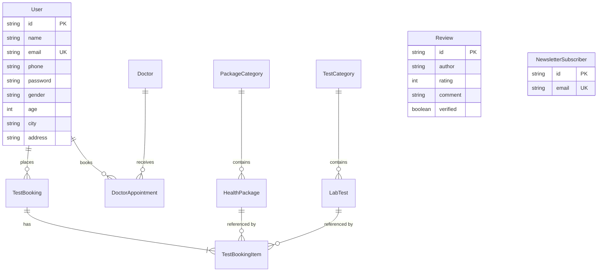

# Pathogo Database Documentation & Architecture

## 1. Overview
The **Pathogo** database is built with **PostgreSQL** and managed using **Prisma ORM**. The schema is normalized (3NF) to minimize data redundancy while maintaining high read/write performance for healthcare diagnostics, test bookings, and doctor consultations.

---

## 2. Entity Relationship Diagram (ERD)

---

## 3. Tables & Relationships

### `PackageCategory` & `HealthPackage`
- **Relationship**: 1-to-Many (`PackageCategory.slug` -> `HealthPackage.categorySlug`).
- **Index**: `HealthPackage.categorySlug` index allows instant category filtering (e.g. Basic, Women, Corporate).

### `TestCategory` & `LabTest`
- **Relationship**: 1-to-Many (`TestCategory.slug` -> `LabTest.categorySlug`).
- **Index**: `LabTest.categorySlug` enables fast lookup of tests by organ/condition (Bone, Diabetes, Heart).

### `TestBooking` & `TestBookingItem`
- **Relationship**: 1-to-Many with `ON DELETE CASCADE`.
- **Purpose**: A patient can book multiple tests and health packages in a single transaction.
- **Indexes**: `bookingNumber` (Unique tracking index) and `patientPhone` (Enables instant patient history lookup).

### `Doctor` & `DoctorAppointment`
- **Relationship**: 1-to-Many (`Doctor.id` -> `DoctorAppointment.doctorId`).
- **Indexes**: `doctorId`, `appointmentNumber`, `patientPhone`.

---

## 4. Interview Technical Questions & Answers

### Q: Why did you choose these tables?
> The domain consists of two distinct core entities: **Diagnostics (Packages & Lab Tests)** and **Consultations (Doctors & Appointments)**. Normalizing `TestBooking` and `TestBookingItem` allows flexible cart checkouts where users can bundle multiple packages and individual tests into a single invoice with discounts and home collection addresses.

### Q: Where did you add indexes and why?
> 1. `bookingNumber` & `appointmentNumber`: Unique indexes for O(1) order tracking lookups.
> 2. `patientPhone`: B-Tree index to power the patient lookup query (`/api/bookings/lookup?phone=...`) without table scans.
> 3. `categorySlug` & `specialtySlug`: Foreign key and filter indexes for lightning-fast catalog navigation.

### Q: What happens when two users modify the same data concurrently?
> - **PostgreSQL MVCC (Multi-Version Concurrency Control)**: PostgreSQL handles concurrent reads and writes without read-blocking.
> - **Optimistic Concurrency Control (OCC)**: Using `updatedAt` timestamps / version columns to detect conflicting writes.
> - **Pessimistic Locking (`SELECT FOR UPDATE`)**: Used when booking high-demand consultation slots to prevent double-booking.
